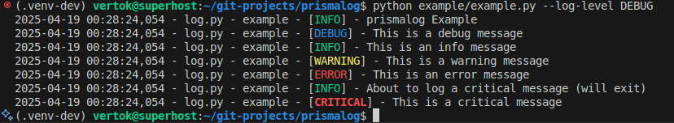

.. _examples:

Examples
========

Basic Logging Example
---------------------

.. code-block:: python

   from prismalog.argparser import extract_logging_args, get_argument_parser
   from prismalog.log import LoggingConfig, get_logger

   # Create parser with standard logging arguments
   parser = get_argument_parser(description="prismalog Example")

   # Parse arguments
   args = parser.parse_args()

   # Extract logging cli arguments
   logging_args = extract_logging_args(args)

   # Initialize with extracted arguments
   LoggingConfig.initialize(use_cli_args=True, **logging_args)

   # Get logger
   log = get_logger("example")
   logger.debug("This is a debug message")
   logger.info("This is an info message")
   logger.warning("This is a warning message")
   logger.error("This is an error message")

   Console output from the example above

Configuration with YAML
-----------------------

.. code-block:: python

   from prismalog.log import LoggingConfig, get_logger

   # Initialize with extracted arguments
   LoggingConfig.initialize(
      use_cli_args=True,
      **{
         "log_config_file": "example/config.yaml",
         "log_level": "DEBUG",
         "log_dir": "mylogs",
         "exit_on_critical": False,
         "colored_console": True,
      })

   # Get logger
   log = get_logger("example")
   logger.info("Logging with custom configuration")

YAML Configuration File:

.. code-block:: yaml

   # config.yaml
   default_level: INFO  # Console logging level  (Optional, default: INFO)
   colored_console: true  # Enable colored console output  (Optional, default: true)
   log_dir: logs  # Directory for log files  (Optional, default: logs)
   # rotation_size_mb: 10  # Rotate log files when they reach this size (in MB)  (Optional, default: 10)
   # backup_count: 5  # Keep this many backup files  (Optional, default: 5)
   exit_on_critical: false  # Do not exit on critical errors  (Optional, default: true)

   # Control third-party libraries
   external_loggers:  # Optional
     requests: WARNING
     urllib3: ERROR

.. _controlling-noisy-libraries:

Controlling Noisy Libraries
---------------------------

.. code-block:: python

   from prismalog.log import LoggingConfig, get_logger

   # Initialize with passed yaml config
   LoggingConfig.initialize(
      use_cli_args=True,
      **{
         "config_file": "example/config.yaml",
      })

   # Get logger
   log = get_logger("example")

   # Now these imports won't flood your logs
   import requests
   import nltk

   # Make HTTP request with controlled logging
   response = requests.get("https://example.com")
   logger.info("Status code: %d", response.status_code)

   # Download NLTK data without verbose output
   nltk.download('punkt')

.. _multi-process-logging:

Multi-process Logging
---------------------

.. code-block:: python

   import multiprocessing
   from prismalog.log import LoggingConfig, get_logger

   def worker_process(name):
       # Each process gets its own logger
       logger = get_logger(f"worker.{name}")
       logger.info(f"Worker {name} started")
       logger.debug(f"Worker {name} doing something")
       logger.info(f"Worker {name} finished")

   if __name__ == "__main__":
       # Initialize logging before creating processes
       LoggingConfig.initialize(use_cli_args=True)
       logger = get_logger("main")

       processes = []
       for i in range(5):
           p = multiprocessing.Process(
               target=worker_process,
               args=(f"process-{i}",)
           )
           processes.append(p)
           p.start()

       for p in processes:
           p.join()

       logger.info("All workers finished")
